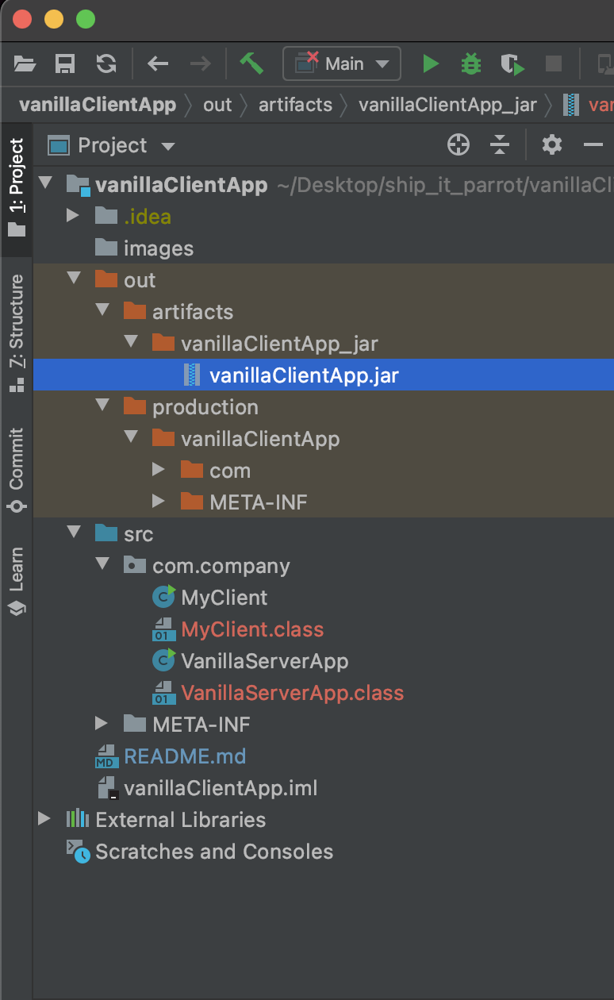

# Creating a Vanilla Server with Java.net

This repository is in a bid to assist a few beloved friends with their homework :)

## Compiling

This is a lean project with one java file, with no dependencies. We are not using Maven as a build tool yet for now.


1. Compiling the server file `VanillaServerApp.java`

```
javac src/com/company/VanillaServerApp.java
```

2. Bringing up the server

```
java -cp src com.company.VanillaServerApp
```

3. Compile the client file `MyClient.java`

```
javac src/com/company/MyClient.java
```

4. Run the Client file to send "Hello World" to the server. The server should print it.

```
java -cp src.com.company.MyClient
```

```
➜  vanillaClientApp git:(master) ✗ java -cp src com.company.VanillaServerApp
Vanilla Server Up. Listening at Port 3000.
line: Hello World!
```

# To build the server file `VanillaServerApp.java` into an artifact

Follow the instructions here with IntelliJ

- https://www.jetbrains.com/help/idea/compiling-applications.html#package_into_jar

You should be able to generate a jar after building the artifact



# Running the server with the `.jar` file

```
java -cp out/artifacts/vanillaClientApp_jar/vanillaClientApp.jar com.company.VanillaServerApp
```